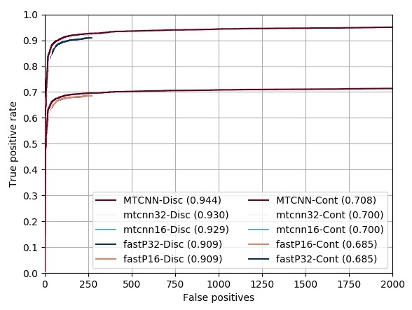

## 前言

[MTCNN](https://github.com/kpzhang93/MTCNN_face_detection_alignment) 是一个快速的人脸检测和对齐算法。本仓库使用 c++ 基于 OpenCV dnn 进行检测。 

## 主要环境

- git
- cmake
- VS2017 or VS2015

### 下载源码

```
git clone https://github.com/yangfly/face.cvdnn.git
```

由于 OpenCV-3.4.2 编译库太大，所以请从 [百度云](https://pan.baidu.com/s/1s9P2D23f_cBIQidN6r6RHg) (提取码: hjjb) 下载，然后解压到根目录。

### 构建工程

1. 双击 build.bat 脚本在 build 下生成 mtcnn.sln 工程;
2. 使用 VS2017 打开 mtcnn.sln 工程，右键 `mtcnn` 设为启动项目；
3. 快捷键 `Ctrl + F5` 快速生成 Release X64 版本并运行；
4. 如果要生成 Debug 版本，请将 `工程` → `属性` → `Debug` → `连接器` → `输入` → `附加依赖项` 中的 `opencv_world432.lib` 修改为 `opencv_world432d.lib`。

**注意**：build.bat 脚本默认构建 VS2017 工程，如果要构建 VS2015 工程，请首先将 build.bat 的第一行改为：
```
set VS=2015
```

### 功能函数说明

- `performance`: 多次检测单张图片，打印 CPU 信息和前向速度。
- `demo`：检测单张图片，在窗口中画出检测结果。
- `fddb_detect`：检测 FDDB 数据集，输出标准格式的检测文件用于评估。

### 性能与准确率

##### Win10 CPU

- 测试环境：Win10 Inter(R) Core(TM) i5-4590 @ 3.30GHz
- w|w/o Lnet：在 sample.jpg 上前向 100 次的平均速度，
- Float16：相对于 Float32，预测速度和准确率几乎没有变化，但是模型容量缩小一半。
- FDDB：参数 
- FDDB Time：Fast PNet 相对于 Pnet，通过减少通道数，以节省前向时间。在 FDDB Time 上时间反而长，是因为 Fast Pnet 准确率的下降，导致 Rnet 需要承担更多筛选 False Examples 的工作量，具体而言，`fastP32` 相对于 `mtcnn32`，RNet 的用时占比从 30.57% 上升到了 52.18%。

模式名  |      Float16       |     Fast Pnet      |  w Lnet  | w/o Lnet | FDDB Time | FDDB Disc | FDDB Cont | 误检数
:-----: | :----------------: | :----------------: | :------: | :------: | :-------: | :-------: | :-------: | :----:
mtcnn32 |        :x:         |        :x:         | 20.08 ms | 18.34 ms | 30.08 ms  |   93.00   |   70.02   |  363
mtcnn16 | :heavy_check_mark: |        :x:         | 20.10 ms | 18.65 ms | 29.60 ms  |   92.92   |   69.95   |  363
fastP32 |        :x:         | :heavy_check_mark: | 14.54 ms | 12.48 ms | 39.89 ms  |   90.93   |   68.52   |  268
fastP16 | :heavy_check_mark: | :heavy_check_mark: | 13.74 ms | 12.20 ms | 39.69 ms  |   90.93   |   68.53   |  269


### FDDB 评估

##### 测试参数：
- face_min_size = 40
- face_max_size = 500
- scale_factor = 0.709f
- thresholds = [0.8f, 0.9f, 0.9f]
- precise_landmark = True # with Lnet



### 参考与致谢

- [MTCNN_face_detection_alignment](https://github.com/kpzhang93/MTCNN_face_detection_alignment/tree/master/code/codes/MTCNNv2/model) @kpzhang93
- [OpenCV](https://github.com/opencv/opencv)