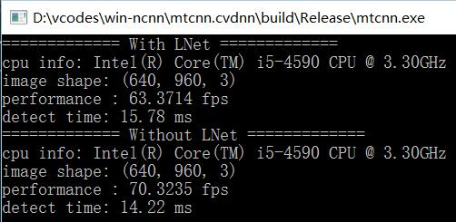
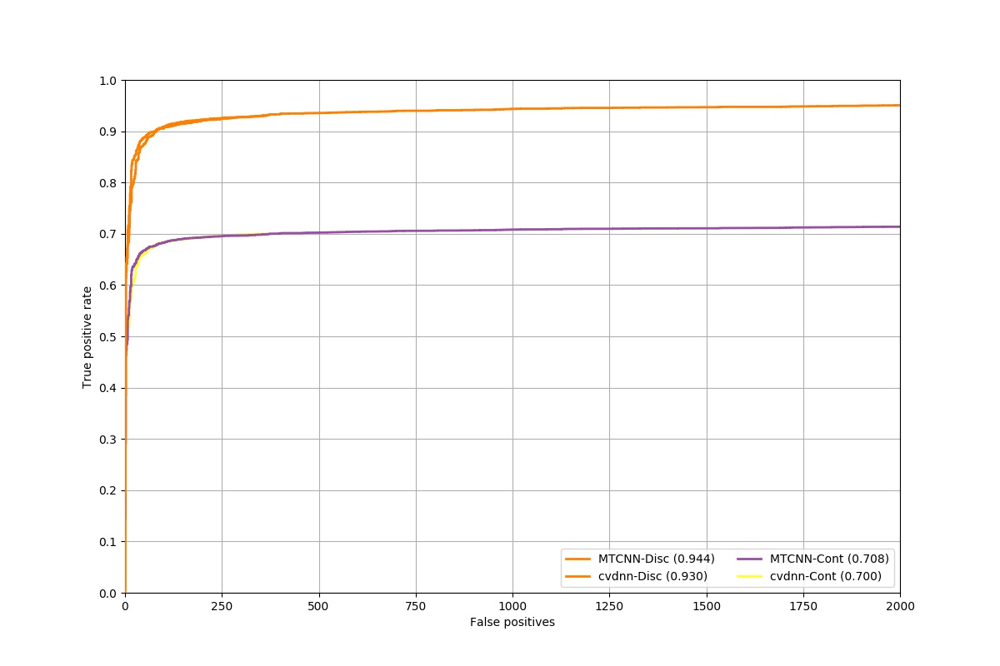

## 前言

[MTCNN](https://github.com/kpzhang93/MTCNN_face_detection_alignment) 是一个快速的人脸检测和对齐算法。本仓库使用 c++ 基于 OpenCV dnn 进行检测。 

## 主要环境

- git
- cmake
- VS2017 or VS2015

### 下载源码

```
git clone https://github.com/yangfly/face.cvdnn.git
```

由于 OpenCV-3.4.2 编译库太大，所以请从 [百度云](https://pan.baidu.com/s/1s9P2D23f_cBIQidN6r6RHg) (提取码: hjjb) 下载，然后解压到根目录。

### 构建工程

1. 双击 build.bat 脚本在 build 下生成 mtcnn.sln 工程;
2. 使用 VS2017 打开 mtcnn.sln 工程，右键 `mtcnn` 设为启动项目；
3. 快捷键 `Ctrl + F5` 快速生成 Release X64 版本并运行；
4. 如果要生成 Debug 版本，请将 `工程` → `属性` → `Debug` → `连接器` → `输入` → `附加依赖项` 中的 `opencv_world432.lib` 修改为 `opencv_world432d.lib`。

**注意**：build.bat 脚本模型构建 VS2017 工程，如果要构建 VS2015 工程，请首先将 build.bat 的第一行改为：
```
set VS=2015
```

### 功能函数说明

- `performance`: 多次检测单张图片，打印 CPU 信息和前向速度。
- `demo`：检测单张图片，在窗口中画出检测结果。
- `fddb_detect`：检测 FDDB 数据集，输出标准格式的检测文件用于评估。

### 性能与准确率

- Win10 CPU 速度

单核：Intel(R) Core(TM) i5-4590 @ 3.30GHz

  模式   |   时间
:------: | :------:
 w LNet  | 20.20 ms
w/o LNet | 18.42 ms



- FDDB 测试结果：

**注意** 我们只用 **363** 个误检对比论文的 **2000** 个误检，从曲线上看，结果相对于官方 matlab 版的精度，毫不逊色。



### 参考与致谢

- [MTCNN_face_detection_alignment](https://github.com/kpzhang93/MTCNN_face_detection_alignment/tree/master/code/codes/MTCNNv2/model) @kpzhang93
- [OpenCV](https://github.com/opencv/opencv)